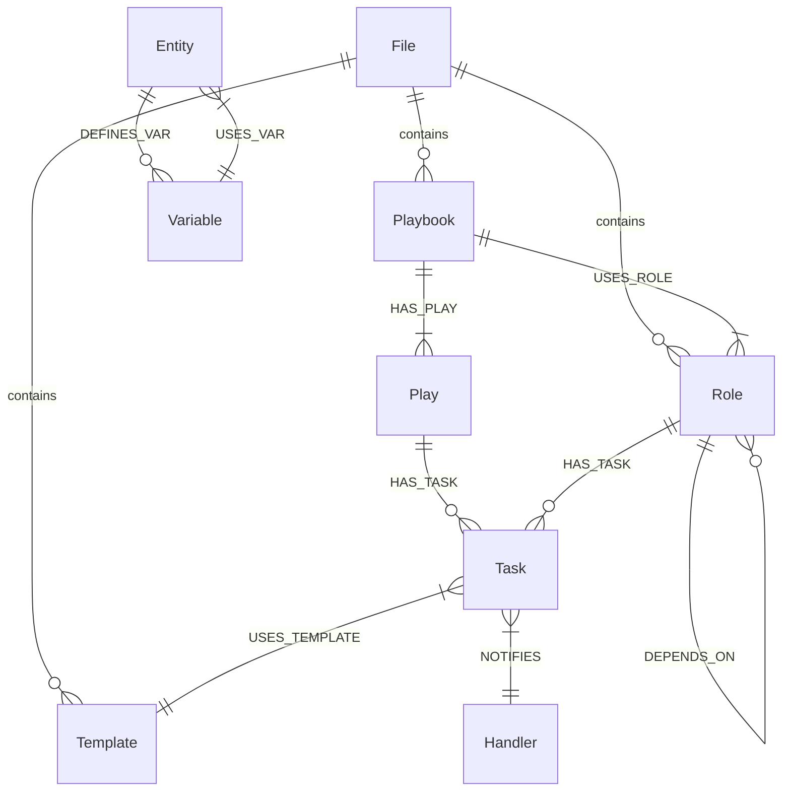

# Graph Schema

The GraphRAG Pipeline uses a native graph schema specifically designed to capture the hierarchy and dependencies of Ansible infrastructure.

## Visual Schema

## Node Types

We define 10 core node types to represent your infrastructure:

| Node | Description | Unique Key |
|------|-------------|------------|
| **`File`** | Any source file (.yml, .py, etc.) | `path` |
| **`Playbook`** | A top-level Ansible playbook | `path` |
| **`Play`** | A mapping of hosts to roles/tasks | `playbook_path` + `order` |
| **`Task`** | An individual Ansible action | `file_path` + `order` |
| **`Handler`** | A task triggered by notifications | `file_path` + `name` |
| **`Role`** | A reusable unit of Ansible logic | `name` |
| **`Variable`** | A data definition or reference | `name` + `scope` |
| **`Template`** | A Jinja2 template file | `path` |
| **`Inventory`** | Source of host/group data | `path` |
| **`VarsFile`** | A file dedicated to variable storage | `path` |

## Relationship Types

The 13 relationships define the structural and data flow between entities:

- **`INCLUDES` / `IMPORTS`**: Capture file inclusion chains.
- **`HAS_PLAY` / `HAS_TASK` / `HAS_HANDLER`**: Map the execution hierarchy.
- **`USES_TEMPLATE`**: Links tasks to their required Jinja2 source files.
- **`DEFINES_VAR` / `USES_VAR`**: Enable deep variable traceability.
- **`USES_ROLE` / `DEPENDS_ON`**: Map role-based dependencies.
- **`NOTIFIES`**: Captures event-driven task links.
- **`LOADS_VARS`**: Shows where variable files are consumed.
- **`IN_FILE`**: Generic link from any entity back to its source file.

## Performance Optimization

The pipeline automatically initializes the following Neo4j structures:

### Unique Constraints

- `CREATE CONSTRAINT FOR (f:File) REQUIRE f.path IS UNIQUE`
- `CREATE CONSTRAINT FOR (r:Role) REQUIRE r.name IS UNIQUE`

### Indexes

- Range indexes on `Task.module` for fast module searching.
- Range indexes on `Variable.name` for variable tracing.
- Text indexes on `Playbook.name` for discovery.

---

## See Also

- [Schema Reference](../reference/schema-reference.md)
- [Extension Points](extension-points.md)
- [Building Graphs](../user-guide/building-graphs.md)
