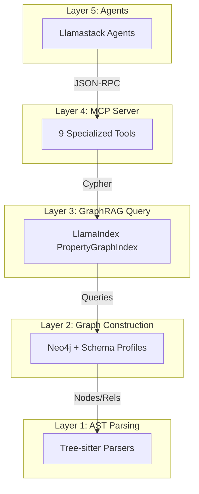

# GraphRAG Pipeline

**Universal codebase analysis using AST knowledge graphs**

The GraphRAG Pipeline transforms your codebases into queryable knowledge graphs, enabling intelligent agents to understand dependencies, trace symbols, and analyze structure with graph-native precision. By bridging the gap between raw source code and structured graph knowledge, we empower LLMs to reason about software systems with unprecedented accuracy.

---

## Features

<div class="grid cards" markdown>

- :material-graph: **Graph-Native Analysis**
    ---

    Maps complex code concepts like classes, functions, and roles to Neo4j nodes and relationships for deep structural analysis.

- :material-magnify: **Universal Traceability**
    ---

    Follow symbol definitions across file boundaries and trace data flow through your entire enterprise codebase.

- :material-api: **MCP Integration**
    ---

    Exposes graph capabilities via the Model Context Protocol, allowing AI agents to "see" and "query" your infrastructure structure directly.

- :material-rocket-launch: **Local LLM Support**
    ---

    Optimized for high-performance local inference using vLLM and Qwen2.5-Coder, ensuring data privacy and low latency.

- :material-auto-fix: **Multi-Language Support**
    ---

    Native support for **Ansible**, **Python**, and **Generic** codebase analysis via a plugin-based extractor framework.

- :material-code-json: **AST-Fidelity Parsing**
    ---

    Uses Tree-sitter for robust, error-tolerant parsing of YAML, Python, Jinja2, and Ruby files, capturing the smallest syntactic details.

</div>

## Supported Languages

| Language | Scope | Support Level |
|----------|-------|---------------|
| **Ansible** | Playbooks, Roles, Vars, Templates | Full (Production) |
| **Python** | Modules, Classes, Functions, Imports | Beta |
| **Generic** | File/Directory structure, References | Alpha |

## Quick Start

Get your knowledge graph running in seconds using our containerized stack:

```bash
# Clone and install
git clone https://github.com/antonysallas/graphrag-codebase.git && cd graphrag-pipeline
uv sync

# Launch Neo4j and MCP server
docker compose up -d

# Build your first graph (auto-detects repo type)
uv run graphrag-build /path/to/your/codebase --clear
```

## Architecture Overview

We use a structured 5-layer design to ensure scalability and maintainability:



## Next Steps

- [:material-timer: **Quickstart Guide**](getting-started/quickstart.md) - Deploy in 5 minutes.
- [:material-layers: **Architecture Deep Dive**](architecture/overview.md) - Learn how the 5 layers work together.
- [:material-book-open-variant: **User Guide**](user-guide/building-graphs.md) - Learn how to build and query graphs.
- [:material-console: **MCP Reference**](reference/mcp-tools-reference.md) - Browse the available AI tools.
