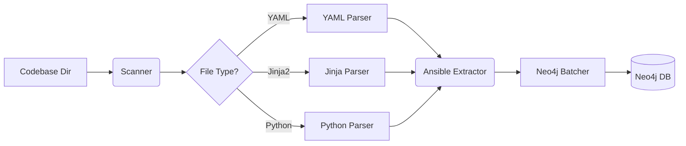

# Building Graphs

Learn how to parse your Ansible codebase and construct a comprehensive knowledge graph in Neo4j.

## The Build Process

The `graphrag-build` CLI executes a 4-stage pipeline to transform source files into graph entities:

1. **Scanning**: The `AnsibleExtractor` traverses the specified directory, identifying relevant files (.yml, .yaml, .j2, .py, Vagrantfile).
2. **AST Parsing**: Each file is processed by a Tree-sitter parser tailored to its language, producing a concrete syntax tree.
3. **Concept Extraction**: Specialized extractors (e.g., `PlaybookExtractor`, `RoleExtractor`) analyze the ASTs to find Ansible-specific entities and their relationships.
4. **Graph Indexing**: Entities are batched and MERGEd into Neo4j, ensuring indexes and constraints are respected.

## Running the Build

We recommend using the `uv run` command to ensure all dependencies are correctly loaded from your virtual environment.

```bash
# Basic build
uv run graphrag-build /path/to/ansible/codebase

# Build with a fresh database
uv run graphrag-build /path/to/ansible/codebase --clear
```

### Advanced Options

| Option | Description |
|--------|-------------|
| `--clear` | Wipes all nodes and relationships before starting. Use this for full re-indexes. |
| `--workers <n>` | Number of parallel worker threads. Defaults to 4. Increase this for large repos. |
| `--log-level <level>` | Set to `DEBUG` to see detailed parsing and extraction logs. |

## Multi-Repository Support

GraphRAG Pipeline supports indexing multiple repositories in a single Neo4j database.

### Building Multiple Repositories

```bash
# Build first repository (repo-id auto-detected from directory name)
uv run python scripts/build_graph.py build /path/to/ansible-for-devops

# Build second repository
uv run python scripts/build_graph.py build /path/to/graphrag-pipeline

# Override auto-detected repo-id if needed
uv run python scripts/build_graph.py build /path/to/repo --repo-id custom-name
```

### Listing Repositories

```bash
uv run python scripts/build_graph.py list-repos
```

### Clearing a Repository

```bash
uv run python scripts/build_graph.py clear-repo ansible-for-devops
```

### How Isolation Works

* Each node (except Role) has a `repository` property
* Queries filter by repository when context is set
* Role nodes remain global for cross-repo dependency tracking

## Build Pipeline Flowchart



## Performance Tuning

For codebases exceeding 5,000 files, consider these optimizations:
* **SSD Storage**: Neo4j performance is highly dependent on disk I/O.
* **Batch Size**: Adjust `BATCH_SIZE` in your `.env` (Default: 100). Higher values (e.g., 500) can speed up writes but use more memory.
* **Heap Size**: Ensure the Neo4j container has at least 2GB of heap allocated (`NEO4J_dbms_memory_heap_max__size`).

---

## See Also
* [Querying Graphs](querying-graphs.md)
* [Configuration Guide](../getting-started/configuration.md)
* [Schema Reference](../reference/schema-reference.md)
